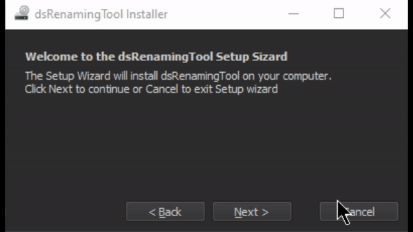

# dsInstaller

 Simple installer for zip packages.



## Installation
```
pip install dsInstaller
```

## Installer class

- Runs preinstall method (override)
- Downloads zip from given link to temp path.
- Extracts to given install directory.
- Removes version or branch name from extracted folder name.
- Runs post install method (override).
- Deletes downloaded temp file.

## UI pages

1. Welcome page
2. Install directory page
3. Install progress
4. Result page

Pages are stored in *QStackedLayout* and new ones can be created as *QWidgets* and inserted into layout at given index.

## Examples

**Installer class**

```py
class dsToolInstaller(installFn.Installer):
    def __init__(self, fileUrl="", modDir="", toolName="dsTool", version="1.0"):
        super().__init__(fileUrl=fileUrl)
        self.toolName = toolName
        self.version = version
        self.modName = f"{self.toolName}.mod"
        self.modDir = modDir
        self.modData = ""

    def postInstall(self):
        """
        Creates .mod file with path to installed tool
        """
        self.modData = f"+ {self.toolName} {self.version} {self.installDir}/{self.toolName}\nscripts: {self.installDir}/{self.toolName}"
        if not self.modDir:
            self.modDir = os.path.expanduser("~/Documents/maya/modules")

        self.createFile(self.modDir, self.modName, self.modData)
```

**Dialog class**
```py
class dsInstallDialog(installUI.InstallDialog):
    def __init__(self, installer: dsToolInstaller, title="dsRenamingTool Installer", minSize=[400, 200], parent=None):
        super(dsInstallDialog, self).__init__(installer=installer, title=title, minSize=minSize, parent=parent)
        self.setWindowIcon(self.style().standardIcon(QtWidgets.QStyle.SP_DriveDVDIcon))

    def createWidgets(self):
        super().createWidgets()
        self.modPage = pages.DirectoryPage(defaultDir=os.path.expanduser(r"~\Documents\maya\modules"))
        self.modPage.dirWidget.group.setTitle("Maya modules folder")

    def createLayouts(self):
        super().createLayouts()
        self.pageStackLayout.insertWidget(2, self.modPage)

    def createConnections(self):
        super().createConnections()
        self.modPage.dirWidget.pathLineEdit.textChanged.connect(self.setModulesDir)

    @QtCore.Slot(str)
    def setModulesDir(self, path: str):
        self.installer.modDir = path
```

**Main function**

```py
def main():
    toolInstall = dsToolInstaller(fileUrl="https://github.com/S0nic014/dsRenamingTool/archive/1.0.zip",
                                  modDir="",
                                  toolName="dsRenamingTool",
                                  version="1.0")

    # Create app
    app = QtWidgets.QApplication(os.sys.argv)
    app.setStyle(QtWidgets.QStyleFactory.create("fusion"))
    app.setPalette(styles.darkPallete())

    window = dsInstallDialog(title="dsRenamingTool Installer", installer=toolInstall, minSize=[400, 200])
    window.show()

    app.exec_()


if __name__ == "__main__":
    elevate.elevate(show_console=False)
    main()
```

Example file:
https://github.com/S0nic014/dsRenamingTool/releases/tag/1.0